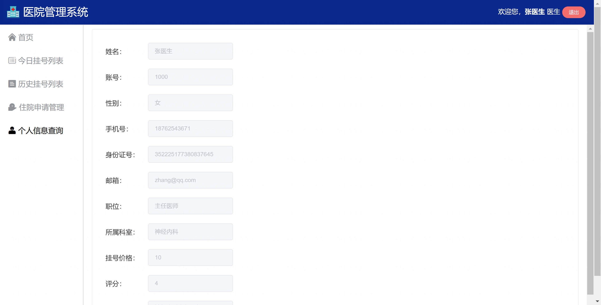

基于Springboot的医院管理系统（程序+论文）
=

### 完整代码获取地址：从戎源码网 ([https://armycodes.com/](https://armycodes.com/))
### 作者微信：19941326836  QQ：952045282 
### 承接计算机毕业设计、Java毕业设计、Python毕业设计、深度学习、机器学习
### 选题+开题报告+任务书+程序定制+安装调试+论文+答辩ppt 一条龙服务
### 所有选题地址https://github.com/nature924/allProject

一、项目介绍
---
基于 Spring Boot + Vue 的医院管理系统，系统角色为管理员、医生和病患，主要功能如下：

管理员（Admin）：
基本操作：登录、修改密码、获取/修改个人信息、查看系统统计信息
医护管理：分页查询/查看医生、添加医生、删除医生、修改医生信息
患者管理：分页查询/查看患者、添加患者、删除患者
挂号管理：分页查询挂号单、删除挂号单、查看挂号明细
排班管理：查看/按日期或科室查询排班、添加排班、删除排班
药品管理：分页查询药物、添加药物、减少库存、查询药物信息
检查项目管理：分页查询/查看/新增/修改检查项
床位管理：床位查询、床位统计（空床数等）
数据统计与导出：各类统计（今日挂号人数、男女比例、科室近 20 天人数、患者年龄分布等），导出挂号单 PDF

医生（Doctor）：
基本操作：登录、获取/修改个人信息、查看今日/指定日期挂号
看诊管理：查看当天/指定医生挂号列表、为挂号单增加诊断与医嘱、判断是否需缴费
患者查询：按 id 查询患者信息
评价管理：对医生评分（更新评分）
统计：获取该医生今日挂号人数、相关数据图表入口

病患（Patient）：
基本操作：登录、获取/修改个人信息
挂号操作：按科室查询医生、选择排班并添加挂号（下单/挂号）
挂号管理：查询本人挂号列表、导出挂号单 PDF
就诊与床位：查看自己的床位信息（入院/出院流程由床位管理支持）
统计/页面展示：查看系统首页统计（今日挂号数、空床数等）

二、项目技术
---
- 编程语言：Java
- 数据库：MySQL
- 项目架构：B/S架构
- 前端技术：JSP
- 后端技术：Spring、SpringMVC、MyBatis

三、运行环境
---
- 操作系统：Windows、macOS都可以
- JDK版本：JDK1.8以上都可以
- 开发工具：IDEA、Ecplise、Myecplise都可以
- 数据库: MySQL5.7以上都可以
- Tomcat：任意版本都可以
- Maven：任意版本都可以

四、运行截图
---
### 论文截图：

### 程序截图：

